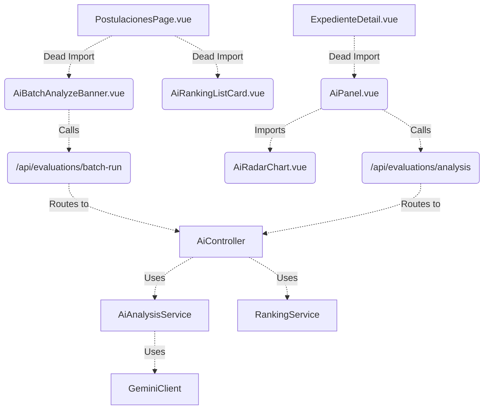

# Reporte de Auditoría de Deuda Técnica y Código Muerto (SISPO)

Este reporte es el resultado de un sondeo completo del código fuente, rutas y base de datos de SISPO. Tiene como propósito mapear el código obsoleto (especialmente la integración legacy con Gemini/IA y la estructura no-normalizada de méritos) para trazar un plan seguro de eliminación por fases.

**Nota Importante:** Ningún archivo ni tabla ha sido eliminado durante esta auditoría. Este reporte es puramente descriptivo y de planificación.

---

## FASE 1 — AUDITORÍA BACKEND

| Archivo / Clase | Uso Actual | Dependencias | Clasificación | Recomendación |
| :--- | :--- | :--- | :--- | :--- |
| `app/Models/AiCvAnalysis.php` | Nulo (Solo BD) | Ninguna activa | `DEPRECATED_SAFE_TO_REMOVE` | Eliminar en Nivel 3. |
| `app/Models/AiMatchingResult.php` | Nulo (Solo BD) | Ninguna activa | `DEPRECATED_SAFE_TO_REMOVE` | Eliminar en Nivel 3. |
| `app/Models/AiJobLog.php` | Nulo (Solo BD) | Ninguna activa | `DEPRECATED_SAFE_TO_REMOVE` | Eliminar en Nivel 3. |
| `app/Models/AiAuditLog.php` | Nulo (Solo BD) | Ninguna activa | `DEPRECATED_SAFE_TO_REMOVE` | Eliminar en Nivel 3. |
| `app/Models/PostulanteMerito.php` | Monitorización | Backend fallback (por remover) | `LEGACY_FALLBACK` | Eliminar tras monitoreo (Fase 3). |
| `app/Models/MeritoArchivo.php` | Monitorización | Backend fallback (por remover) | `LEGACY_FALLBACK` | Eliminar tras monitoreo (Fase 3). |
| `app/Http/Controllers/AiController.php` | Nulo. Sin rutas | Frontend retirado | `DEPRECATED_SAFE_TO_REMOVE` | Eliminar en Nivel 2. |
| `app/Services/Ai/AiAnalysisService.php` | Nulo | Ninguna | `DEPRECATED_SAFE_TO_REMOVE` | Eliminar directorio `Ai/`. |
| `app/Services/Ai/GeminiClient.php` | Nulo | Ninguna | `DEPRECATED_SAFE_TO_REMOVE` | Eliminar directorio `Ai/`. |
| `app/Services/Ai/MatchingEngine.php` | Nulo | Ninguna | `DEPRECATED_SAFE_TO_REMOVE` | Eliminar directorio `Ai/`. |
| `app/Services/Ai/PdfExtractorService.php` | Nulo | Ninguna | `DEPRECATED_SAFE_TO_REMOVE` | Eliminar directorio `Ai/`. |
| `app/Services/Ai/PromptBuilder.php` | Nulo | Ninguna | `DEPRECATED_SAFE_TO_REMOVE` | Eliminar directorio `Ai/`. |
| `app/Services/Ai/RankingService.php` | Nulo | Ninguna | `DEPRECATED_SAFE_TO_REMOVE` | Eliminar directorio `Ai/`. |
| `app/Jobs/AnalyzeCvJob.php` | Nulo | Ninguna | `DEPRECATED_SAFE_TO_REMOVE` | Eliminar en Nivel 2. |
| `app/Jobs/BatchAnalyzeJob.php` | Nulo | Ninguna | `DEPRECATED_SAFE_TO_REMOVE` | Eliminar en Nivel 2. |
| `routes/api.php` (`/api/evaluations/run`, etc.) | Nulo | `AiController` | `DEPRECATED_SAFE_TO_REMOVE` | Eliminar inmediatamente. |

---

## FASE 2 — AUDITORÍA FRONTEND

El frontend (`sispo-front/src`) fue escaneado en búsqueda de menciones y usos de componentes obsoletos.

| Componente (`src/components/Ai/`) | Importado En | Ruta | Visible en Menú | Eliminable | Reemplazo Sugerido |
| :--- | :--- | :--- | :--- | :--- | :--- |
| `AiPanel.vue` | `ExpedienteDetail.vue` (Huérfano) | No | No | SÍ | Reemplazado por Score Profiles nativos |
| `AiAuditTimeline.vue` | No importado | No | No | SÍ | N/A |
| `AiBatchAnalyzeBanner.vue` | `PostulacionesPage.vue` (Huérfano) | No | No | SÍ | Eliminación directa |
| `AiHumanOverrideDialog.vue` | No importado | No | No | SÍ | Workspace UI standard |
| `AiObservationsCard.vue` | No importado | No | No | SÍ | N/A |
| `AiRadarChart.vue` | `AiPanel.vue` | No | No | SÍ | N/A |
| `AiRankingListCard.vue` | `PostulacionesPage.vue` (Huérfano) | No | No | SÍ | N/A |
| `AiScoreBadge.vue` | No importado | No | No | SÍ | N/A |
| `AiSkeletonLoader.vue` | No importado | No | No | SÍ | N/A |

---

## FASE 3 — AUDITORÍA DE RUTAS Y ENDPOINTS

Rutas identificadas mediante `route:list`:

| Endpoint | Controlador | Clasificación |
| :--- | :--- | :--- |
| `GET /api/evaluations/analysis/{postulacionId}` | `AiController@getAnalysis` | `LEGACY_ALIAS` (A eliminar) |
| `POST /api/evaluations/batch-run/{convocatoriaId}` | `AiController@batchAnalyze` | `DEPRECATED` |
| `GET /api/evaluations/ranking/{convocatoriaId}` | `AiController@getRanking` | `DEPRECATED` |
| `POST /api/evaluations/recalculate/{id}` | `AiController@reanalyze` | `DEPRECATED` |
| `POST /api/evaluations/run/{postulacionId}` | `AiController@analyzeCV` | `DEPRECATED` |
| `POST /api/evaluations/override/{id}` | `AiController@humanOverride` | `DEPRECATED` |
| `GET /api/postulaciones/{id}/expediente` | `PostulacionController@expediente` | `ACTIVE_CORE` |
| `POST /api/postulaciones` | `PostulacionController@store` | `ACTIVE_CORE` |

---

## FASE 4 — AUDITORÍA DE BASE DE DATOS

| Tabla / Columna | Recibe Escritura | Recibe Lectura | Clasificación | Dependencias Restantes |
| :--- | :--- | :--- | :--- | :--- |
| `tipos_documento` | NO | Fallback (Legacy frontend UI) | `LEGACY_READONLY` | Desacoplamiento final frontend pendiente. |
| `postulante_meritos` | NO (Monitoreado) | NO (Monitoreado) | `DEPRECATED` | Ninguna. Lista para Nivel 3. |
| `merito_archivos` | NO (Monitoreado) | NO (Monitoreado) | `DEPRECATED` | Ninguna. Lista para Nivel 3. |
| `ai_cv_analyses` | NO | NO | `DEPRECATED` | Ninguna. |
| `ai_matching_results` | NO | NO | `DEPRECATED` | Ninguna. |
| `ai_job_logs` | NO | NO | `DEPRECATED` | Ninguna. |
| `source_merito_id` (en tablas nuevas) | NO | NO | `DEPRECATED` | Usado solo en script temporal. |
| `requires_ai_review` | NO | NO | `DEPRECATED` | Reglas retiradas del Score Engine. |

---

## FASE 5 — DEPENDENCY GRAPH (AI/GEMINI)


**Veredicto:** Toda la familia de clases `Ai*` y `Gemini*` es un ecosistema aislado completamente obsoleto. Se puede eliminar el directorio entero.

---

## FASE 6 — PLAN DE LIMPIEZA PROPUESTO

### Nivel 1 — Limpieza Segura Inmediata (Go: Inmediato)
1. **Frontend:** Eliminar imports huérfanos en `PostulacionesPage.vue` y `ExpedienteDetail.vue`.
2. **Frontend:** Eliminar carpeta `src/components/Ai/` completa.
3. **Backend:** Eliminar de `routes/api.php` todos los endpoints bajo `/api/evaluations/` asociados al `AiController`.

### Nivel 2 — Limpieza Controlada Backend (Go: Inmediato post-Nivel 1)
1. Eliminar controlador `app/Http/Controllers/AiController.php`.
2. Eliminar carpeta de servicios completa `app/Services/Ai/`.
3. Eliminar jobs obsoletos: `AnalyzeCvJob.php` y `BatchAnalyzeJob.php`.
4. Eliminar modelos obsoletos: `AiCvAnalysis.php`, `AiMatchingResult.php`, `AiJobLog.php`, `AiAuditLog.php`.

### Nivel 3 — Limpieza de Base de Datos y Legacy Meritos (Go: Post-Monitoreo 72h)
1. Eliminar tablas AI (Migración DROP de `ai_cv_analyses`, `ai_matching_results`, `ai_job_logs`).
2. Ejecutar Migración DROP de tablas legacy de méritos (`postulante_meritos`, `merito_archivos`).
3. Ejecutar Migración ALTER TABLE DROP COLUMN para `source_merito_id`, `requires_ai_review`.

---

## FASE 7 — COMANDOS DE SOPORTE CREADOS
Se ha inyectado exitosamente el comando:
```bash
php artisan sispo:audit-dead-code
```
Este comando escanea en tiempo real el uso real en código de todas las clases sospechosas mencionadas en la Fase 1. 
Para frontend, se documenta la recomendación de usar `npx depcheck` y limpieza mediante `eslint --fix`.

---

## 8. RECOMENDACIÓN FINAL (GO / NO-GO)
**DICTAMEN: GO PARA NIVEL 1 Y 2.**
El sistema está desacoplado del motor de IA inicial y de la estructura pivot legacy. El Nivel 1 (rutas, componentes sin uso) y Nivel 2 (clases aisladas) tienen Riesgo Cero, por lo que su eliminación mejorará los tiempos de compilación, reducirá tamaño del bundle y eliminará deuda técnica masiva de forma instantánea.

El Nivel 3 se retendrá hasta la culminación del periodo de monitorización activado en el release anterior.
